# Architecture Design Document: Medication Reminder

This document defines the high-level software architecture, data structures, and engineering guidelines for the **Medication Reminder** mobile application. It has been prepared from the perspective of a Principal Flutter Software Architect.

---

## 1. Overall Architecture

The application is built using a combination of **Clean Architecture** principles and a **Feature-First** organization pattern. The architecture is split into distinct logical boundaries to enforce the separation of concerns, improve testability, and support modular development.

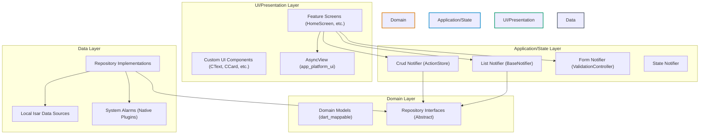

*   **Offline-First & Core abstractions:** The database (`Isar`) and notification system (`flutter_local_notifications`) exist entirely on the client.
*   **Dependency Injection:** Managed purely through **Riverpod** providers. No runtime reflection or service locators.

---

## 2. Feature-First Folder Structure

To keep domain features self-contained and modular, the codebase organizes code inside domains and features rather than technological layers.

```
lib/
├── core/
│   ├── theme/
│   ├── database/                            # Isar database initialization
│   └── notifications/                       # Local Notifications manager wrapper
├── features/
│   └── medications/                         # Domain: Medications
│       ├── medication_management/           # Feature: Medication CRUD
│       │   ├── models/
│       │   │   ├── models.dart
│       │   │   ├── medication_field.dart
│       │   │   ├── medication_state_model.dart
│       │   │   ├── add/medication_add_model.dart
│       │   │   └── edit/medication_edit_model.dart
│       │   ├── repositories/
│       │   │   ├── repositories.dart
│       │   │   ├── medication_repository.dart
│       │   │   └── medication_repository_impl.dart
│       │   ├── providers/
│       │   │   ├── providers.dart
│       │   │   ├── medication_state_notifier.dart
│       │   │   ├── medication_crud_notifier.dart
│       │   │   └── medication_form_provider.dart
│       │   └── presentation/
│       │       ├── screens/
│       │       │   └── edit_medication_screen.dart
│       │       └── widgets/
│       ├── today_dashboard/                 # Feature: Chronological view of today's schedule
│       │   ├── models/
│       │   ├── repositories/
│       │   ├── providers/
│       │   │   └── dashboard_list_notifier.dart
│       │   └── presentation/
│       │       ├── screens/
│       │       │   └── dashboard_screen.dart
│       │       └── widgets/
│       └── compliance_history/              # Feature: Historical logging & filtering
│           ├── models/
│           ├── repositories/
│           ├── providers/
│           │   ├── history_list_notifier.dart
│           │   └── history_filters_provider.dart
│           └── presentation/
│               └── screens/
│                   └── history_screen.dart
└── main.dart
```

---

## 3. Layer Responsibilities

### 3.1 UI / Presentation Layer
*   Responsible for rendering screens and layout logic.
*   **Mandatory Reusable Components:** Must only use `CScaffold`, `CText`, `CTextField`, `CButton`, `CDialog`, `CAppBar`, and `CCard` from `app_platform_ui`. Flutter framework equivalents (e.g., `Scaffold`, `Text`) are forbidden.
*   **Routing & Navigation:** Strictly handled by the project's static navigation component `CNavigator` (e.g., `CNavigator.push(...)`, `CNavigator.pop(...)`). Do not use `GoRouter` or custom Navigator wrappers.
*   **State Rendering:** Employs `AsyncView<T>` from `app_platform_ui` to render loaders, error layouts, empty states, and success boundaries automatically based on the notifier's `LoadStatus`.

### 3.2 Application / State Layer
*   Holds UI state, executes form validations, and interfaces with Domain Repositories.
*   **CRUD Operations:** Utilizes `ActionStore` from `app_platform_state` to track action execution state (loading, success, failure) by `ActionKey`.
*   **List Views:** Subclasses `BaseNotifier<T>` to manage listing states (`loading`, `success`, `error`) and updates.
*   **Form Validation:** Inherits from `ValidationController<K>` to check form values on-the-fly and bind fields to error text models.

### 3.3 Domain Layer
*   Contains core business entities, parameters, models, and repository contracts.
*   **Zero Dependencies:** This layer has zero dependencies on other layers or database libraries. It only relies on `dart_mappable` for value object helpers.

### 3.4 Data Layer
*   Implements repository interfaces, interacts with Isar collections, and coordinates native hardware plugins (like device alarm managers and notification drawers).
*   Returns `Result<T>` types (`Success(T)` or `Failure(AppError)`) to protect callers from raw SQLite/Isar database crashes.

---

## 4. Dependency Rule

```
[UI/Presentation] ────> [Application/State] ────> [Domain] <──── [Data/Infrastructure]
```

*   **Direction of Dependencies:** Dependencies point inward toward the Domain layer. 
*   **Abstraction Binding:** The UI and Application layers only reference abstract repository interfaces. The concrete implementations are resolved dynamically via Riverpod at runtime.
*   **No Circular References:** Feature-to-feature dependency at the Presentation layer is forbidden. Sharing state must occur in the Application/State layer via Riverpod references (`ref.watch`).

---

## 5. Feature Boundaries

To prevent tight coupling between features, features communicate using a strict pattern of state subscription.

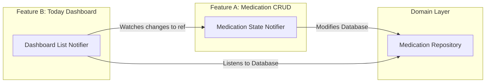

1.  **Repository Sharing:** Repositories are shared across a domain. `TodayDashboard` reads from the database through the same `MedicationRepository` that `MedicationCRUD` modifies.
2.  **Notifier Watchers:** The `DashboardListNotifier` watches state events of `MedicationCrudNotifier` or references database streams to automatically trigger page refreshes when a medication is updated or deleted.

---

## 6. Domain Models

All domain models use the `dart_mappable` package for type-safe serializations, immutability, and simple `copyWith` structures.

### 6.1 Medication Domain Model
```dart
import 'package:dart_mappable/dart_mappable.dart';

part 'medication_domain_model.mapper.dart';

@MappableClass()
class MedicationModel with MedicationModelMappable {
  final String id; // UUID
  final String name;
  final String dosage;
  final String color; // Hex string (e.g. "#FF4F46E5")
  final String priority; // 'Critical' | 'Normal' | 'Low'
  final bool isActive;
  final DateTime createdAt;
  final DateTime updatedAt;

  MedicationModel({
    required this.id,
    required this.name,
    required this.dosage,
    required this.color,
    required this.priority,
    required this.isActive,
    required this.createdAt,
    required this.updatedAt,
  });
}
```

### 6.2 MedicationSchedule Domain Model
```dart
import 'package:dart_mappable/dart_mappable.dart';

part 'medication_schedule_domain_model.mapper.dart';

@MappableClass()
class MedicationScheduleModel with MedicationScheduleModelMappable {
  final String id; // UUID
  final String medicationId;
  final String time; // e.g. "08:00"
  final String repeatType; // 'EveryDay' | 'SelectedDays' | 'EveryXHours' | 'EveryXDays' | 'OneTime' | 'Custom'
  final List<int>? weekdays; // 1 = Monday, 7 = Sunday
  final int? interval; // Used for "Every X Hours" or "Every X Days"
  final DateTime startDate;
  final DateTime? endDate;

  MedicationScheduleModel({
    required this.id,
    required this.medicationId,
    required this.time,
    required this.repeatType,
    this.weekdays,
    this.interval,
    required this.startDate,
    this.endDate,
  });
}
```

### 6.3 DoseLog Domain Model
```dart
import 'package:dart_mappable/dart_mappable.dart';

part 'dose_log_domain_model.mapper.dart';

@MappableClass()
class DoseLogModel with DoseLogModelMappable {
  final String id; // UUID
  final String medicationId;
  final String scheduleId;
  final DateTime scheduledAt;
  final DateTime? actionAt;
  final String status; // 'Taken' | 'Missed' | 'Snoozed'

  DoseLogModel({
    required this.id,
    required this.medicationId,
    required this.scheduleId,
    required this.scheduledAt,
    this.actionAt,
    required this.status,
  });
}
```

---

## 7. Repository Structure

Repositories return standard functional constructs using the `Result<T>` type from `app_platform_core` to avoid unhandled async exceptions in UI screens.

```dart
// domain/repositories/medication_repository.dart
abstract class MedicationRepository {
  Future<Result<List<MedicationModel>>> getMedications();
  Future<Result<MedicationModel>> getMedicationById(String id);
  Future<Result<void>> saveMedication(MedicationModel medication, List<MedicationScheduleModel> schedules);
  Future<Result<void>> deleteMedication(String id);
  Future<Result<List<MedicationScheduleModel>>> getSchedulesByMedicationId(String medicationId);
}

// domain/repositories/dose_log_repository.dart
abstract class DoseLogRepository {
  Future<Result<List<DoseLogModel>>> getLogs({
    required DateTime start,
    required DateTime end,
    String? medicationId,
  });
  Future<Result<void>> logDose(DoseLogModel log);
  Future<Result<void>> updateLogStatus(String logId, String status, DateTime actionAt);
}
```

---

## 8. Local Data Sources

Isar Collections represent the concrete storage schema. Data sources map these collections to immutable Domain Models.

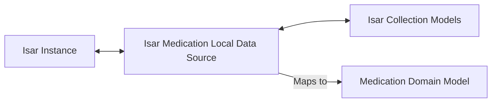

### Data Source Architecture Principles:
1.  **Isolation:** The database data source handles raw Isar queries, database transaction starts, and database errors.
2.  **No Isar Leakage:** Database models (`MedicationCollection`) never travel past the repository implementation level. All data is mapped to Domain Models before passing to the state layer.

---

## 9. Riverpod Provider Hierarchy

Riverpod provides clean, compile-time verified dependency injection across all features.

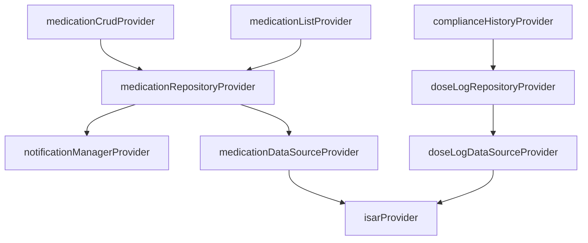

---

## 10. Notification Architecture

Local notification management abstracts platform-specific quirks (Android Channel priorities vs iOS Permissions) into a single unified API.

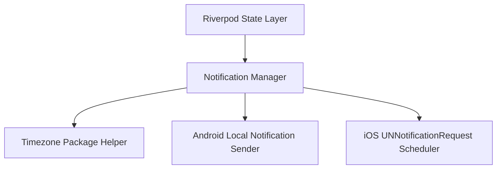

### 10.1 Scheduling Algorithm:
*   Alarms are registered using `flutter_local_notifications` with precise timing configuration.
*   **Timezone Independence:** Stored schedule times (e.g. "08:00 AM") are converted to `TZDateTime` using the local device location details to trigger alerts relative to the physical clock of the user.

---

## 11. Local Scheduling Flow

Due to the iOS native limit of **64 active local notifications**, the local alarm queue manages alert requests intelligently.

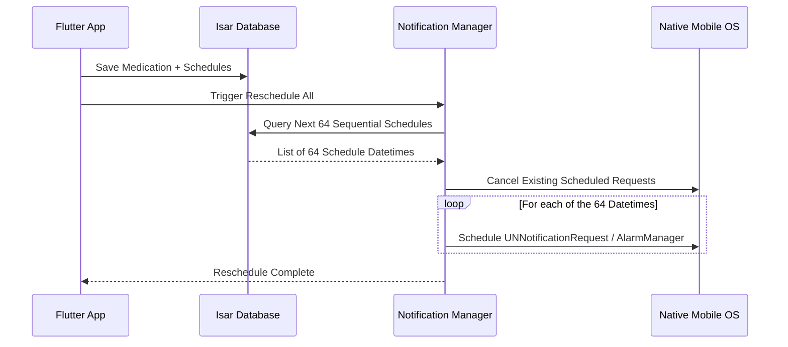

*   **Boot Resilience:** The native receiver (`RECEIVE_BOOT_COMPLETED` on Android) restarts the scheduling sequence immediately when the phone boots up, ensuring alarms are never dropped.

---

## 12. Database Collections

Isar collections require a unique integer index ID. To use UUIDs safely for future cloud synchronization:
1.  Isar models define a self-incrementing local integer `id`.
2.  A unique String index `uuid` is registered to hold the true business ID.

### 12.1 Medication Collection
```dart
import 'package:isar/isar.dart';

part 'medication_collection.g.dart';

@collection
class MedicationCollection {
  Id id = Isar.autoIncrement;

  @Index(unique: true, replace: true)
  late String uuid;

  late String name;
  late String dosage;
  late String color;
  late String priority;
  late bool isActive;
  late DateTime createdAt;
  late DateTime updatedAt;
}
```

### 12.2 MedicationSchedule Collection
```dart
import 'package:isar/isar.dart';

part 'medication_schedule_collection.g.dart';

@collection
class MedicationScheduleCollection {
  Id id = Isar.autoIncrement;

  @Index(unique: true, replace: true)
  late String uuid;

  @Index()
  late String medicationUuid;

  late String time;
  late String repeatType;
  late List<int> weekdays;
  late int interval;
  late DateTime startDate;
  late DateTime endDate;
}
```

### 12.3 DoseLog Collection
```dart
import 'package:isar/isar.dart';

part 'dose_log_collection.g.dart';

@collection
class DoseLogCollection {
  Id id = Isar.autoIncrement;

  @Index(unique: true, replace: true)
  late String uuid;

  @Index()
  late String medicationUuid;
  
  @Index()
  late String scheduleUuid;

  late DateTime scheduledAt;
  late DateTime actionAt;
  late String status; // 'Taken', 'Missed', 'Snoozed'
}
```

---

## 13. Application Lifecycle Handling

To handle day changes or updates to scheduled tasks when the app is running in the background, a lifecycle manager monitors changes.

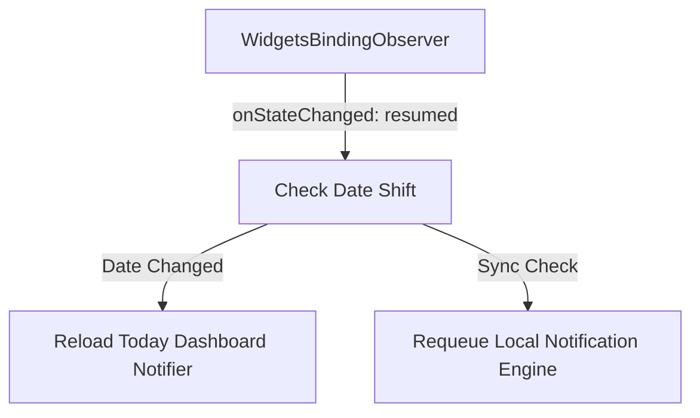

*   **Dashboard Refresh:** Triggered automatically if the device clock crosses midnight while the app is backgrounded.
*   **Notification Re-alignment:** Runs whenever the app regains system focus to ensure the local OS alarm queue matches the current database records.

---

## 14. Dependency Graph

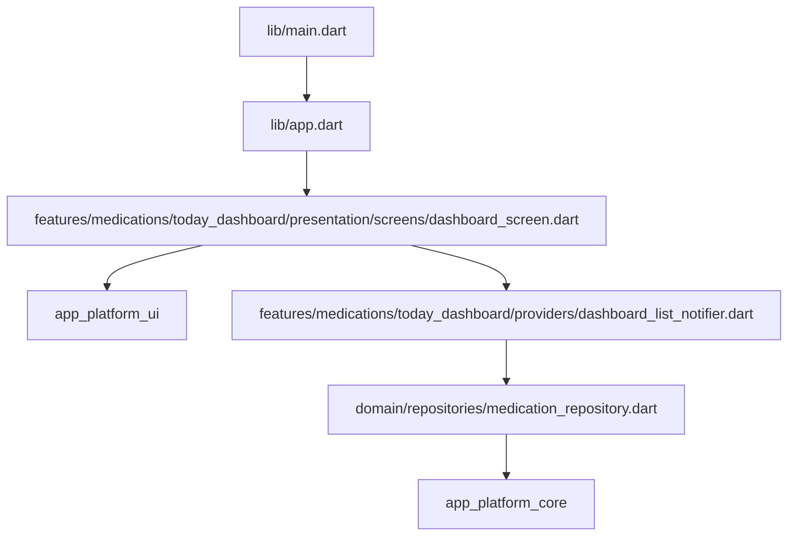

---

## 15. Data Flow Diagrams

This diagram illustrates how data flows during a read and write operation.

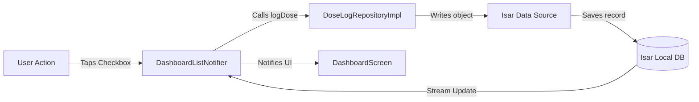

---

## 16. Sequence Diagrams

### 16.1 Adding a Medication Flow
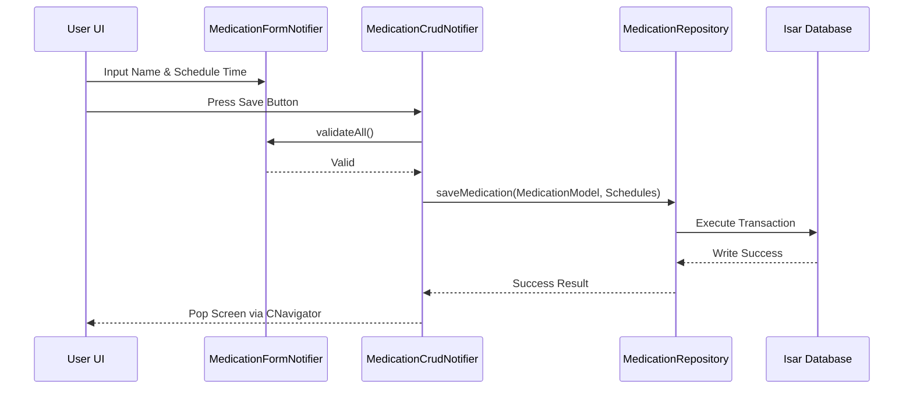

### 16.2 Notification Trigger and Dose Logging Flow
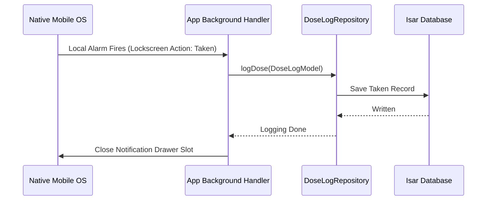

---

## 17. Error Handling Strategy

The system enforces a **No-Throw** policy for business and data execution logic. 

```
[Isar Exception] ────> Caught in Repo ────> Returned as Result.failure(DatabaseError)
```

1.  **Result Class Wrapper:** Repository methods must return a `Result<T>` instead of throwing exceptions.
    *   `Result.success(data)` indicates a clean run.
    *   `Result.failure(appError)` wraps the platform error.
2.  **AppError Conversions:** In repository implementations, all database calls are wrapped in `try-catch` blocks where raw exceptions are parsed into unified `AppError` cases (e.g. `DatabaseError`, `ValidationError`).

---

## 18. Logging Strategy

Since the app is 100% offline and telemetry is forbidden (MVP Scope), the logging strategy is strictly local.

*   **Console Logging:** Log events are printed using the debug utility `developer.log` only in debug mode, hidden in release mode.
*   **Database Transaction Logs:** Errors from Isar writes are captured in a local rolling text-file log stored in the app's sandboxed document folder to aid diagnostic analysis if requested by the user.

---

## 19. Testing Strategy

The architecture separates infrastructure dependencies to make writing unit tests simple.

*   **Unit Tests:** Targets domain model serialization (`dart_mappable` checks), repositories, and notifiers. Repositories are tested by mock data sources.
*   **Widget Tests:** Uses Riverpod's `ProviderScope.overrides` to inject stub repositories, rendering components in isolation without database access.
*   **Integration Tests:** Verifies the native scheduler plugin and Isar collections on real device simulators.

---

## 20. Scalability Strategy

This design is structured to allow future scale migrations without rewriting the app core.

*   **Future Cloud Sync:** Since all tables are normalized and key relationships rely on UUIDs rather than auto-incrementing integer keys, migrating to database synchronizations (e.g. Firebase Firestore, Supabase, or custom REST APIs) only requires writing a remote data source wrapper at the Repository level.
*   **Authentication & Multi-Tenant Support:** The normalization separation (`Medication` holds meta-data, `DoseLog` holds logs) allows adding a `userId` field to partition data locally and cloud-side when multi-user support is implemented.

---

## 21. Architecture Decision Records (ADR)

### ADR-007: Navigation via Reusable CNavigator Components
*   **Context:** The app needs to navigate between screens (CRUD forms, dashboard, adherence logs).
*   **Decision:** Do not use `GoRouter`. Use project-standard wrappers `CNavigator.push`, `CNavigator.pop`, etc.
*   **Consequence:** Simplifies screen flows and preserves standard platform routing transitions while utilizing unified design component hooks.

### ADR-008: Database Storage Engine Selection - Isar
*   **Context:** The application operates 100% offline and requires relational links, indices, and stream support.
*   **Decision:** Choose Isar Database over raw SQLite or Hive.
*   **Consequence:** Provides reactive stream queries to auto-update notifiers and runs faster than SQLite on mobile hardware, while preserving type safety.

### ADR-009: Normalized Database Design
*   **Context:** Medications can have multiple schedules and generate thousands of log entries over years.
*   **Decision:** Normalize tables into `Medication`, `MedicationSchedule`, and `DoseLog` using UUID indexes.
*   **Consequence:** Prevents document bloat, keeps database queries lightweight, and supports easy schema synchronization to cloud backends in the future.
