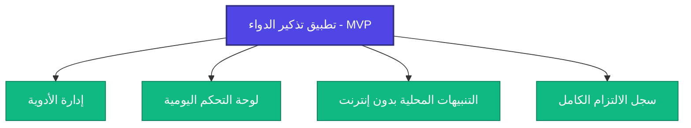

# وثيقة تعريف المنتج: تذكير الدواء (تطبيق Flutter يعمل بالكامل بدون إنترنت)

هذه الوثيقة تؤسس للقواعد الاستراتيجية، والمنتجية، والتصميمية التقنية لتطبيق الهاتف المحمول **تذكير الدواء**. تم إعدادها من منظور مدير منتجات أول ومهندس معمارية تطبيقات الهواتف المحمولة.

---

## 1. بيان المشكلة

يعتمد ملايين الأفراد على أنظمة الأدوية اليومية لإدارة الأمراض المزمنة، أو الحفاظ على صحة جيدة، أو التعافي من الحالات الحادة. ومع ذلك، فإن الحفاظ على الالتزام يمثل تحديًا عالميًا بسبب النسيان، أو الجداول المزدحمة، أو أنظمة الجرعات المعقدة.

الحلول الحالية للأجهزة المحمولة في السوق غالبًا ما تكون متضخمة، وتتطلب إنشاء حساب إلزامي، واتصالاً بالإنترنت، ورسوم اشتراك. بالإضافة إلى ذلك، فإن الكثير منها يجمع معلومات صحية شخصية حساسة للغاية (PHI) ويقوم بتحميلها إلى السحابة، مما يشكل مخاطر خصوصية كبيرة. علاوة على ذلك، فإنها غالبًا ما تعاني من واجهات مستخدم معقدة وأنظمة إرسال إشعارات غير موثوقة ناتجة عن تحسينات البطارية الصارمة على مستوى نظام التشغيل.

---

## 2. الرؤية

بناء تطبيق تذكير دواء هو الأكثر موثوقية، وتركيزًا على الخصوصية، وخفة الوزن، ويعمل **بالكامل بدون اتصال بالإنترنت (100% Offline)** مع **عدم وجود أي حواجز للإعداد والتكوين**. سيعمل التطبيق كمساعد صحي رقمي يحترم خصوصية المستخدم، ويستهلك الحد الأدنى من موارد الجهاز، ويضمن ألا يفوت المستخدمون جرعة أبدًا، بغض النظر عن توفر اتصال بالإنترنت.

---

## 3. الأهداف

*   **العمل الكامل بدون إنترنت:** يجب أن يعمل التطبيق بالكامل دون الحاجة إلى اتصال بالإنترنت، أو خادم سحابي، أو أي تبعية لواجهة برمجة تطبيقات خارجية.
*   **الخصوصية كركيزة أساسية:** عدم وجود إنشاء حسابات، عدم تتبع سلوك المستخدم، وتخزين جميع البيانات الصحية حصريًا على جهاز المستخدم المحلي.
*   **موثوقية فائقة للتنبيهات:** تقديم تنبيهات محلية بموثوقية تقارب 100%، والتغلب على قيود توفير الطاقة في أنظمة التشغيل (وضع Doze في Android وقيود الخلفية في iOS).
*   **البساطة المطلقة:** واجهة مستخدم بديهية وسهلة الوصول تتيح للمستخدمين تهيئة التطبيق وإعداد تذكير في أقل من 60 ثانية، مما يجعله مناسبًا لجميع الفئات العمرية.

---

## 4. المستخدمون المستهدفون

1.  **كبار السن ومرضى الأمراض المزمنة:** الأفراد الذين يديرون حالات طويلة الأمد (مثل ارتفاع ضغط الدم والسكري) ويحتاجون إلى إشعارات يومية بسيطة ومتكررة.
2.  **المهنيون والطلاب المشغولون:** الأفراد الذين يتناولون المكملات اليومية، أو حبوب منع الحمل، أو الوصفات الطبية قصيرة الأجل والذين يحتاجون إلى تذكيرات هادئة وموثوقة دون إزعاجهم بإعلانات تسويقية أو طلب إنشاء حسابات.
3.  **المستخدمون المهتمون بالخصوصية:** الذين يرفضون تخزين بياناتهم الطبية في السحاب ويفضلون الاحتفاظ بجميع بياناتهم محليًا بشكل آمن.
4.  **المسافرون وسكان المناطق النائية:** الذين يعملون في بيئات تفتقر للاتصال بالإنترنت (الطائرات، الأماكن النائية، المناطق ذات الشبكات الضعيفة).

---

## 5. شخصيات المستخدمين

### الشخصية أ: آرثر بندلتون (المريض المزمن)
*   **العمر:** 72
*   **المهنة:** معلم متقاعد
*   **المعرفة التقنية:** منخفضة إلى متوسطة
*   **النظام العلاجي:** يتناول 4 أدوية مختلفة في 3 أوقات مختلفة على مدار اليوم.
*   **الاحتياجات:** حجم خط كبير، منبهات واضحة وعالية، مؤشر مرئي بسيط للأدوية التي يجب تناولها بعد ذلك، وعدم وجود خطوات تسجيل دخول محيرة. ليس لديه باقة بيانات إنترنت على هاتفه المحمول ويعتمد كليًا على الميزات غير المتصلة بالإنترنت.

### الشخصية ب: د. بريا ناير (المهنية المشغولة)
*   **العمر:** 32
*   **المهنة:** طبيبة أطفال
*   **المعرفة التقنية:** عالية
*   **النظام العلاجي:** تتناول فيتامينًا يوميًا ودواء للغدة الدرقية في الصباح.
*   **الاحتياجات:** إعداد سريع للغاية، لوحة تحكم نظيفة تعرض جدولها اليومي، إشعارات تفاعلية لتسجيل تناول الدواء مباشرة من شاشة القفل، وواجهة مستخدم بدون أي تأخير. ترفض استخدام التطبيقات التي تتتبع بياناتها أو ترسل إشعارات مزعجة.

---

## 6. نقاط ألم المستخدمين

| الفئة | نقاط الألم في الحلول الحالية | حل تطبيق تذكير الدواء |
| :--- | :--- | :--- |
| **الخصوصية والأمان** | التسجيل الإلزامي ورفع البيانات الصحية الحساسة إلى قواعد بيانات عن بعد. | **بدون سحابة:** لا حسابات، لا تتبع بيانات، قاعدة بيانات محلية 100% تعمل بدون إنترنت. |
| **سهولة الاستخدام** | واجهات معقدة للغاية مع إعلانات ومقالات وعروض ترقية مدفوعة. | **واجهة نظيفة:** تخطيط سريع ومركّز على المهام ومخصص فقط للتذكيرات. |
| **الموثوقية** | كتم التنبيهات أو تفويت الإشعارات بسبب إعدادات توفير البطارية. | **منبهات محلية:** التكامل مع نظام جدولة التنبيهات الأصلي لتجاوز أوضاع سكون النظام. |
| **الاتصال** | فشل التطبيقات في التحميل أو حفظ التقدم عند عدم الاتصال بالإنترنت. | **التخزين المحلي:** لا يوجد اعتماد على الاتصال. كل شيء يعمل بشكل فوري. |

---

## 7. القيمة المقترحة الأساسية

> **"مساعد أدوية موثوق وجميل يعيش بالكامل على جهازك. لا يتطلب إنترنت، لا يحتاج لإنشاء حسابات، ويوفر خصوصية مطلقة لبياناتك الصحية."**

---

## 8. نطاق المنتج الأدنى (MVP Scope)

تم حصر نطاق الـ MVP بدقة لتوفير أقصى قدر من الموثوقية بأقل تعقيد. يركز التطبيق بالكامل على جدولة ومتابعة أوقات تناول الأدوية محليًا.

---

## 9. الميزات المضمنة في MVP

### 1. جدولة الأدوية (CRUD)
*   إنشاء وقراءة وتحديث وحذف ملفات الأدوية محليًا.
*   تحديد اسم الدواء، ووصف الجرعة (مثل "قرص واحد"، "5 مل")، ولون الدواء، ومستوى الأولوية. تستخدم جميع السجلات معرفات فريدة عالميًا (UUIDs).
*   **محرك جدولة مرن:**
    *   *دعم البنية التحتية:* مصمم لدعم نماذج تكرار متعددة تشمل: *كل يوم*، *أيام محددة*، *كل X ساعات*، *كل X أيام*، *مرة واحدة*، و*جدول مخصص*.
    *   *استثناءات واجهة مستخدم MVP:* ستعرض الواجهة الأولى للتطبيق خيارات الجدولة *كل يوم* و*أيام محددة* فقط للحفاظ على بساطة التجربة، بينما تدعم قاعدة البيانات ونظام الإشعارات الأساسي جميع أنواع الجدولة الأخرى.

### 2. لوحة التحكم لليوم
*   عرض زمني مرتب لجميع الأدوية المجدولة لليوم الحالي.
*   تصنيف ديناميكي إلى قسمين: **قيد الانتظار (Pending)** و**تم تناولها (Taken)**.
*   خيار النقر السريع أو التمرير لتسجيل الجرعات كـ "تم تناولها".

### 3. محرك التنبيهات والإشعارات المحلية
*   إطلاق تنبيهات محلية بدقة عالية في الوقت المحدد.
*   إشعارات تفاعلية تحتوي على إجراءات سريعة (مثل "تناول الآن" أو "تأجيل 10 دقائق") تعمل مباشرة من لوحة إشعارات الجهاز دون الحاجة لفتح التطبيق.
*   صوت تنبيه مخصص وعلامات أولوية عالية لضمان الظهور الفوري.

### 4. سجل تاريخ الالتزام (Compliance History Log)
*   **قدرة التخزين المحلي:** تخزين جميع سجلات الأدوية التاريخية بالكامل وبشكل دائم على قاعدة البيانات المحلية دون حدود للتخزين.
*   **عرض لوحة التحكم:** تعرض اللوحة الرئيسية تاريخ الالتزام لآخر 7 أيام فقط للحفاظ على واجهة بسيطة وعملية.
*   **بنية التصفية والاستعلام:** تدعم قاعدة البيانات تصفية السجلات حسب: *آخر 7 أيام*، *آخر 30 يومًا*، *نطاق تاريخ مخصص*، و*كل السجل التاريخي*.

---

## 10. الميزات المستبعدة صراحةً من MVP

> [!WARNING]
> لضمان الإطلاق السريع والأداء الموثوق للميزات الأساسية، تم تأجيل الميزات التالية للإصدارات المستقبلية.

1.  **المزامنة السحابية والنسخ الاحتياطي:** لا توجد قواعد بيانات عن بعد، أو مزامنة سحابية، أو حسابات مستخدمين.
2.  **متابعة المخزون وإعادة التعبئة:** لا توجد حسابات لكميات الأدوية المتبقية أو تنبيهات بنفادها.
3.  **تكامل واجهة برمجيات قواعد بيانات الأدوية:** لا يوجد بحث عن الأدوية أو التحقق من التداخلات الدوائية (يجب على المستخدمين إدخال الأسماء يدويًا).
4.  **الدورات المعقدة:** مثل الجدولة الدورية (مثلاً "21 يوم تناول، و7 أيام توقف").
5.  **مراقبة العائلات/الأطباء:** لا توجد إمكانية لمشاركة البيانات أو إرسال تقارير عبر البريد أو الرسائل النصية.
6.  **القفل الحيوي (البصمة/الوجه):** مستبعد نظراً لأن البيانات مشفرة ومحفوظة داخل مساحة التطبيق الآمنة محلياً.

---

## 11. مخطط قاعدة البيانات الموحد (Normalized Database Schema)

لضمان متانة النظام وسهولة التوسع، تعتمد قاعدة البيانات على تصميم موحد (Normalized) بدلاً من تخزين البيانات في ملفات مسطحة أو سلاسل JSON. وتستخدم جميع الكيانات معرفات UUID كمفاتيح أساسية (دون الاعتماد أبداً على أسماء الأدوية).

### 11.1 تعريفات الكيانات

#### 1. الدواء (Medication)
يخزن البيانات التعريفية لكل دواء.
*   `id`: UUID (سلسلة نصية) - مفتاح أساسي.
*   `name`: سلسلة نصية - اسم الدواء (مثل "ليسينوبريل").
*   `dosage`: سلسلة نصية - تعليمات الجرعة (مثل "قرص واحد"، "10 مل").
*   `color`: سلسلة نصية - رمز اللون (Hex) لتمييز الدواء مرئياً وتسهيل التعرف عليه.
*   `priority`: سلسلة نصية/Enum - الأولوية (`Critical` حرجة، `Normal` عادية، `Low` منخفضة).
*   `isActive`: منطقي - لتفعيل أو إيقاف التنبيهات لهذا الدواء مؤقتًا.
*   `createdAt`: طابع زمني.
*   `updatedAt`: طابع زمني.

#### 2. جدول الدواء (MedicationSchedule)
يخزن تفاصيل المواعيد وقواعد التكرار. يمكن أن يرتبط دواء واحد بعدة جداول مواعيد.
*   `id`: UUID (سلسلة نصية) - مفتاح أساسي.
*   `medicationId`: UUID - مفتاح أجنبي يربط بجدول الدواء `Medication(id)`.
*   `time`: سلسلة نصية - وقت التنبيه بتنسيق 24 ساعة (مثل "08:00").
*   `repeatType`: سلسلة نصية/Enum - نوع التكرار (`EveryDay`, `SelectedDays`, `EveryXHours`, `EveryXDays`, `OneTime`, `Custom`).
*   `weekday`: قائمة أرقام (Nullable) - أيام الأسبوع المحددة (مثلاً 1 للاثنين، 7 للأحد).
*   `interval`: عدد صحيح (Nullable) - قيمة الفاصل الزمني (مثلاً 3 لـ "كل 3 ساعات" أو "كل 3 أيام").
*   `startDate`: تاريخ - تاريخ بدء العمل بالجدول.
*   `endDate`: تاريخ (Nullable) - تاريخ اختياري لانتهاء صلاحية الجدول.

#### 3. سجل الجرعة (DoseLog)
يسجل الأحداث الفعلية لتناول الدواء أو تفويت الجرعة.
*   `id`: UUID (سلسلة نصية) - مفتاح أساسي.
*   `medicationId`: UUID - مفتاح أجنبي يربط بجدول الدواء `Medication(id)`.
*   `scheduleId`: UUID - مفتاح أجنبي يربط بجدول مواعيد الدواء `MedicationSchedule(id)`.
*   `scheduledAt`: طابع زمني - الوقت الذي كان يفترض فيه تناول الجرعة.
*   `actionAt`: طابع زمني (Nullable) - الوقت الفعلي الذي قام فيه المستخدم بالإجراء (تناول/تأجيل/تفويت).
*   `status`: سلسلة نصية/Enum - حالة الجرعة (`Taken` تم التناول، `Missed` فائتة، `Snoozed` مؤجلة).

### 11.2 الفوائد المعمارية للتطبيع (Normalization)

*   **تحسين قابلية التوسع:** فصل الخصائص الثابتة للدواء عن جداول المواعيد وسجلات الجرعات يحافظ على خفة قاعدة البيانات. آلاف السجلات في `DoseLog` ترتبط ببيانات دواء واحد دون تكرار الاسم أو اللون أو الأولوية.
*   **دعم ميزات جديدة دون تغيير المخطط:** يتيح حقل الأولوية (`priority`) تخصيص سلوك التنبيهات على مستوى نظام التشغيل (مثل إشعارات منبثقة مستمرة للأدوية الحرجة `Critical` وإشعارات صامتة للفيتامينات `Low`) دون الحاجة لتغيير هيكل قاعدة البيانات مستقبلاً.
*   **حفظ دقة السجلات التاريخية:** يضمن التطبيع بقاء التاريخ دقيقاً حتى عند تعديل الجداول. إذا قام المستخدم بتغيير موعد دواء اليوم، تظل سجلات الجرعات التاريخية (`DoseLog`) مرتبطة بالموعد القديم والوقت الفعلي للجرعة.
*   **مرونة محرك الجدولة:** تخزين الجداول كصفوف مستقلة يسهل دعم الفترات المعقدة (مثل "كل X ساعات") دون الحاجة لتحليل مصفوفات معقدة ومدمجة (مثل `List<Time>`) داخل جدول الدواء الرئيسي.

---

## 12. المتطلبات الوظيفية

### 12.1 تسجيل الأدوية (F-101)
*   **F-101.1:** يجب أن يوفر التطبيق نموذج "إضافة دواء" يتطلب إدخال الاسم، وصف الجرعة، اختيار لون محدد، تحديد مستوى الأولوية، ووقت واحد على الأقل للجدول.
*   **F-101.2:** يجب أن يدعم التطبيق جدولة مواعيد متعددة للدواء الواحد عبر نموذج `MedicationSchedule` الموحد.
*   **F-101.3:** يجب أن يتمكن المستخدم من تحديد أيام معينة من الأسبوع للجدولة.
*   **F-101.4:** عند حذف دواء، يجب حذف جميع الجداول المرتبطة به والتنبيهات المستقبلية تلقائيًا مع الاحتفاظ بسجلات الجرعات التاريخية في جدول `DoseLog`.

### 12.2 لوحة التحكم وتسجيل الالتزام (F-102)
*   **F-102.1:** يجب أن تعرض الشاشة الرئيسية أدوية اليوم مرتبة ترتيبًا زمنيًا حسب وقت الجدولة.
*   **F-102.2:** النقر على "تم التناول" يجب أن يحدث قاعدة البيانات، ويضع علامة تم تناول الدواء لهذه الجرعة، ويظهر تأثيرًا بصريًا يؤكد ذلك.
*   **F-102.3:** الجرعات التي مر وقتها المحدد دون إجراء من المستخدم يجب أن تظهر بمؤشر مرئي يفيد بأنها "فائتة" أو "متأخرة".

### 12.3 آلية التنبيه (F-103)
*   **F-103.1:** يجب أن يقوم التطبيق بتسجيل المنبهات المحلية باستخدام ساعة نظام الجهاز (باستخدام `android_alarm_manager_plus` أو واجهات برمجية أصلية مماثلة على Android و`UNNotificationRequest` على iOS).
*   **F-103.2:** إذا استخدم المستخدم إجراء "تناول الآن" المباشر من الإشعار، يجب على النظام تسجيل الجرعة كـ "تم تناولها" في قاعدة البيانات المحلية فورا دون إجباره على فتح التطبيق.

---

## 13. المتطلبات غير الوظيفية

### 13.1 الموثوقية وبنية المنصات
*   **N-101 (العمل دون اتصال بالإنترنت):** يجب أن تتم جميع عمليات القراءة والكتابة محليًا باستخدام محرك تخزين محلي مدمج (مثل SQLite أو Isar أو Hive). يمنع تمامًا إجراء أي طلبات شبكة.
*   **N-102 (استمرارية التنبيهات):** يجب أن تستمر التنبيهات المجدولة حتى بعد إعادة تشغيل الجهاز. يجب على التطبيق تسجيل مستقبل تشغيل الجهاز (`RECEIVE_BOOT_COMPLETED` في Android) لإعادة جدولة جميع التنبيهات المعلقة تلقائيًا.
*   **N-103 (كفاءة استهلاك البطارية):** يجب تقييد استخدام wake-locks وعمليات الخلفية بشكل صارم لمنع استنزاف بطارية الجهاز.

### 13.2 الأمن وخصوصية البيانات
*   **N-201 (عدم التتبع والقياس):** يجب ألا يرسل التطبيق أي بيانات تشخيصية أو تحليلات أو تتبع سلوكي إلى أي خوادم خارجية.
*   **N-202 (حماية البيانات):** يجب حفظ ملفات قاعدة البيانات داخل المجلد الآمن والخاص بالتطبيق (Sandbox) بحيث لا يمكن للتطبيقات الأخرى الوصول إليها.

### 13.3 الأداء وسهولة الاستخدام
*   **N-301 (زمن استجابة البدء):** يجب أن يكون وقت التفاعل الأول (TTI) للتطبيق أقل من **800 مللي ثانية** على الأجهزة المتوسطة.
*   **N-302 (متطلبات الوصول):** يجب أن يتوافق تباين الألوان مع معايير WCAG AA. يجب إرفاق مؤشرات الألوان بتسميات نصية لمساعدة المستخدمين المصابين بعمى الألوان. يجب أن تكون مساحة النقر للعناصر التفاعلية $48 \times 48$ بكسل منطقي على الأقل. يجب دعم تكبير الخطوط التلقائي للنظام.

---

## 14. قصص المستخدمين

### US-1: إضافة دواء يومي
*   **بصفتي** مستخدمًا يتناول دواء ضغط الدم كل صباح،
*   **أريد أن** أكتب سريعًا "ليسينوبريل 10 ملغ"، وأختار اللون الأزرق، وأحدد أولوية عالية، وأضبط المنبه على "08:00 صباحًا" يوميًا،
*   **حتى** أتلقى إشعارًا في هذا الوقت تمامًا للحفاظ على صحتي.
*   *معايير القبول:*
    *   يمكن للمستخدم إضافة الدواء في أقل من 4 نقرات من الشاشة الرئيسية.
    *   يظهر الجدول في لوحة التحكم تحت موعد "08:00 صباحًا" مميزًا باللون المختار.
    *   يتم تسجيل إشعار محلي على مستوى نظام التشغيل متكرر يوميًا الساعة 08:00 صباحًا.

### US-2: تسجيل تناول الدواء من الإشعار
*   **بصفتي** طبيبًا مشغولاً في عيادة،
*   **أريد أن** أسجل تناول الدواء مباشرة من إشعار شاشة القفل،
*   **حتى لا** أضطر لفتح قفل هاتفي، والبحث عن التطبيق، وفتحه يدويًا.
*   *معايير القبول:*
    *   يعرض التنبيه زر "تم التناول".
    *   يؤدي النقر على الزر إلى إغلاق الإشعار وكتابة حدث "تم التناول" في قاعدة البيانات المحلية فورا.

### US-3: تتبع سجل الالتزام بالدواء
*   **بصفتي** مريضًا مزمنًا يراجع إحصاءاته الصحية،
*   **أريد أن** أرى سجل التزامي بالدواء وأقوم بتصفيته لفترات محددة (مثل آخر 7 أيام، 30 يومًا، أو نطاق مخصص)،
*   **So that** أتمكن من مراجعة التزامي على المدى الطويل وتقديمه بدقة لطبيبي.
*   *معايير القبول:*
    *   تعرض شاشة السجل بيانات الالتزام، وتكون افتراضياً لآخر 7 أيام.
    *   يمكن للمستخدم اختيار فلاتر محددة مسبقًا (آخر 7 أيام، آخر 30 يومًا، السجل بالكامل) أو اختيار نطاق تاريخ مخصص.
    *   يعرض كل يوم في النطاق المحدد نسبة الالتزام (مثل "تم تناول 3/4").
    *   يؤدي النقر على اليوم إلى إظهار قائمة مفصلة بما تم تناوله أو تفويته أو تأجيله.

---

## 15. مقاييس النجاح

بما أن التطبيق يعمل بالكامل دون اتصال بالإنترنت ودون أي تتبع، فإن مقاييس النجاح تركز على التقييمات اليدوية ومراجعات المتاجر وسجلات الأخطاء المحلية.

*   **تقييم المتجر:** استهداف الحصول على تقييم $\ge 4.7$ نجوم، مع التركيز على المراجعات التي تثني على "البساطة" و"الموثوقية".
*   **دقة تسليم الإشعارات:** معدل تسليم بنسبة 100% في حدود $\pm 60$ ثانية من الوقت المستهدف أثناء الاختبارات المحلية.
*   **معدل الانهيار (Crash Rate):** أقل من 0.1% من الجلسات (يتم التحقق منها عبر لوحة مطوري المتاجر التي يوفرها نظام التشغيل).
*   **التحقق من عدم تسريب البيانات:** يجب أن تؤكد اختبارات مراقبة شبكة الاتصال أن التطبيق لا يجري أي اتصال بالإنترنت أثناء تشغيله.

---

## 16. Risks & Assumptions

### Risk 1: قاتلو التطبيقات الصارمون في أنظمة التشغيل (Android)
*   **الوصف:** يقوم مصنعو الأجهزة (Samsung, Xiaomi, Huawei) بإنهاء عمليات الخلفية بشكل عدواني وتأخير التنبيهات القياسية لتوفير الطاقة.
*   **التخفيف:** 
    *   استخدام واجهات برمجة تنبيهات دقيقة ومحمية (`AlarmManager.setExactAndAllowWhileIdle`).
    *   توفير شاشات إرشادية داخل التطبيق توجه المستخدم لكيفية استبعاد التطبيق من تحسينات البطارية الخاصة بنظام التشغيل.

### Risk 2: حدود جدولة الإشعارات (iOS)
*   **الوصف:** تضع شركة Apple حدًا أقصى للإشعارات المحلية يبلغ 64 إشعارًا مجدولاً لكل تطبيق.
*   **التخفيف:**
    *   بناء نظام جدولة ذكي: عند فتح التطبيق، يقوم بجدولة التنبيهات الـ 64 القادمة تلقائيًا.
    *   إعداد مهمة خلفية خفيفة لتحديث وتعبئة هذه الجدولة إذا لم يفتح المستخدم التطبيق لفترة طويلة.

### Assumption 1: تغير المنطقة الزمنية
*   **الوصف:** قد يسافر المستخدم ويغير منطقته الزمنية.
*   **التخفيف:** تخزن قاعدة البيانات التواريخ والأوقات بالتنسيق المحلي (مثل "08:00") بدلاً من طوابع UTC المطلقة، مما يضمن تفعيل المنبه في الساعة 08:00 صباحًا حسب وقت الجهاز الحالي.

---

## 17. بنية جاهزة للتوسع المستقبلي (Future Ready Architecture)

على الرغم من أن التطبيق يعمل حاليًا بالكامل دون اتصال بالإنترنت ودون حسابات مستخدمين، فإن تقسيم الكود والتطبيع الهيكلي لقاعدة البيانات يضمنان التوافق المستقبلي دون الحاجة لإعادة كتابة النظام:

*   **المزامنة السحابية:** يضمن استخدام معرفات UUID كمفاتيح أساسية عدم حدوث أي تصادم في البيانات عند مزامنة السجلات المحلية مع خوادم سحابية مستقبلاً (مثل Firestore أو PostgreSQL).
*   **حسابات المستخدمين وتعدد العملاء:** يتطلب الانتقال إلى حسابات سحابية إضافة حقل `userId` فقط إلى جدول `Medication` وجدول `DoseLog` دون الحاجة لتغيير العلاقات الأساسية.
*   **المشاركة العائلية:** يتيح جدول السجلات الموحد عمل استعلامات لدمج وعرض سجلات التزام عدة مستخدمين أو أجهزة لعرضها من قبل مقدمي الرعاية.
*   **تكامل الساعات الذكية (WatchOS/WearOS):** يسهل مزامنة جداول المواعيد مع الساعات الذكية كونها تحتاج فقط إلى قراءة كائن JSON بسيط من جدول `MedicationSchedule` المحلي وتفعيل إشعاراتها الخاصة.
*   **مساعد الذكاء الاصطناعي:** يتيح تسجيل الأوقات المجدولة مقابل الأوقات الفعلية في جدول `DoseLog` معالجة البيانات كسلاسل زمنية دقيقة لتمكين الذكاء الاصطناعي من تحليل أنماط الالتزام (مثلاً: "أنت أكثر عرضة بنسبة 40% لتفويت جرعاتك أيام الثلاثاء").

---

## 18. القرارات المعمارية (Architectural Decisions)

### ADR-001: العمل دون اتصال بالإنترنت أولاً (Offline First)
*   **السبب (Reason):**
    *   **الخصوصية (Privacy):** حماية كاملة لبيانات المستخدم الطبية الحساسة ومنعها من مغادرة الجهاز.
    *   **الموثوقية (Reliability):** ضمان عمل التطبيق وإرسال التنبيهات حتى في حال عدم وجود شبكة اتصال.
    *   **التكلفة الصفرية (Zero Cost):** عدم الحاجة لتحمل تكاليف تشغيل خوادم سحابية أو استهلاك بيانات المستخدم.

### ADR-002: قاعدة بيانات Isar (Isar Database)
*   **السبب (Reason):**
    *   **السرعة الفائقة (Fast):** توفير أداء استعلام وقراءة/كتابة سريع جداً مقارنة بالخيارات الأخرى.
    *   **قاعدة بيانات كائنية (Object Database):** تسهيل التعامل مع كائنات Dart البرمجية مباشرة دون تعقيدات تحويل الجداول.
    *   **العمل دون اتصال (Offline):** مصممة خصيصاً للعمل بكفاءة داخل بيئة التطبيق المحلية.
    *   **تفاعلية (Reactive):** تدعم البث المباشر (Streams) لتحديث واجهة المستخدم بمجرد تغيير البيانات تلقائياً.

### ADR-003: إدارة الحالة باستخدام Riverpod (Riverpod)
*   **السبب (Reason):**
    *   **قابلة للتوسع (Scalable):** تتيح إدارة منطق الأعمال المعقد وحالة التطبيق بشكل منظم مع نمو التطبيق.
    *   **قابلة للاختبار (Testable):** تسهيل كتابة اختبارات الوحدة (Unit Tests) واختبارات الواجهة (Widget Tests) لعزل الحالة.
    *   **أمان وقت الترجمة (Compile-time Safe):** تقليل أخطاء وقت التشغيل من خلال التحقق من صحة موفري الحالة (Providers) أثناء كتابة الكود.

### ADR-004: نظام التوجيه GoRouter (GoRouter)
*   **السبب (Reason):**
    *   **نظام التوجيه الرسمي (Official Routing):** مدعوم رسمياً من فريق Flutter ومبني على نظام Router (Navigator 2.0).
    *   **جاهز للروابط العميقة (Deep Link Ready):** يسهل التعامل مع الروابط العميقة والمسارات النصية، مما يفيد في فتح التطبيق على صفحة معينة من خلال التنبيهات.

### ADR-005: معرفات UUID (UUID)
*   **السبب (Reason):**
    *   **مزامنة سحابية مستقبلية (Future Cloud Sync):** يضمن إمكانية مزامنة البيانات مع أي خادم مستقبلي دون تصادم المفاتيح.
    *   **خالٍ من النزاعات (Conflict Free):** توليد معرفات فريدة محلياً دون الحاجة لاستعلام قاعدة بيانات مركزية أو خادم لتعيين المعرف القادم.

### ADR-006: لغة التصميم Material 3 (Material 3)
*   **السبب (Reason):**
    *   **واجهة مستخدم حديثة (Modern UI):** توفير تجربة بصرية معاصرة وجميلة تتناسب مع أحدث أنظمة التشغيل (Android 12+ و iOS).
    *   **إمكانية الوصول (Accessibility):** دعم متطور لتباين الألوان، وأحجام الخطوط المرنة، وتصميمات مريحة لجميع الفئات بما فيهم كبار السن.

